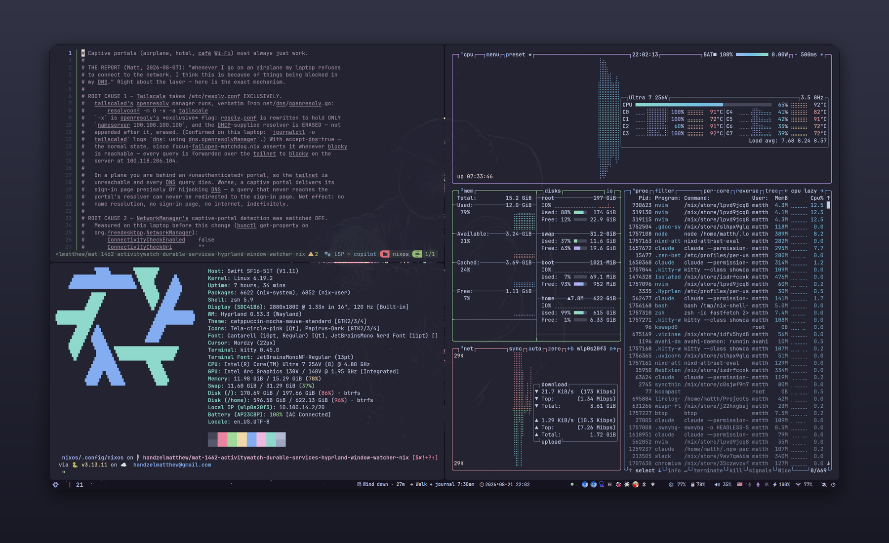
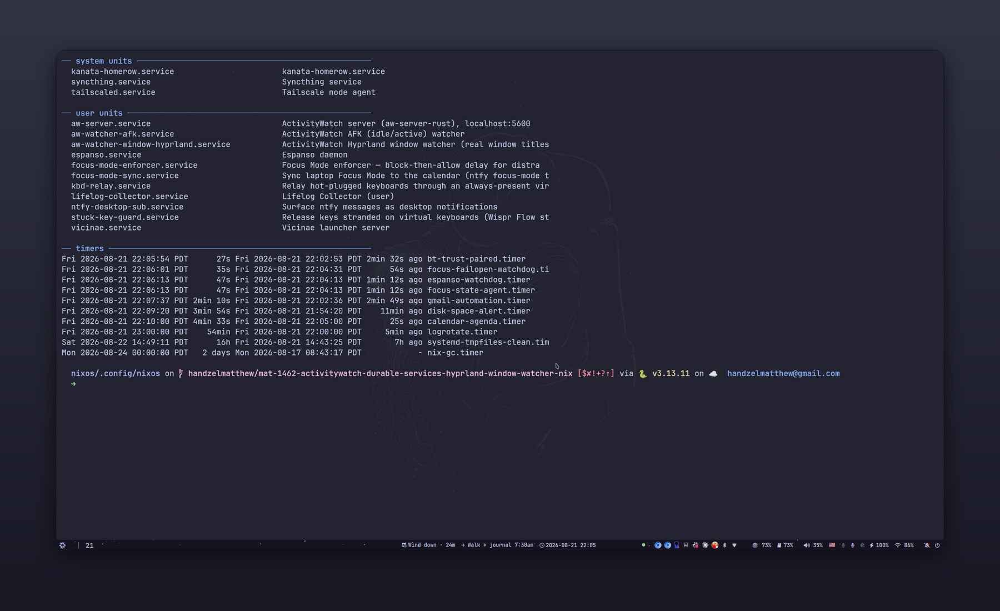
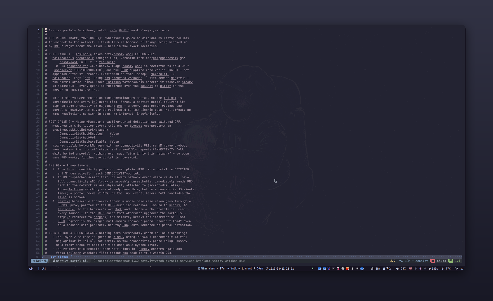
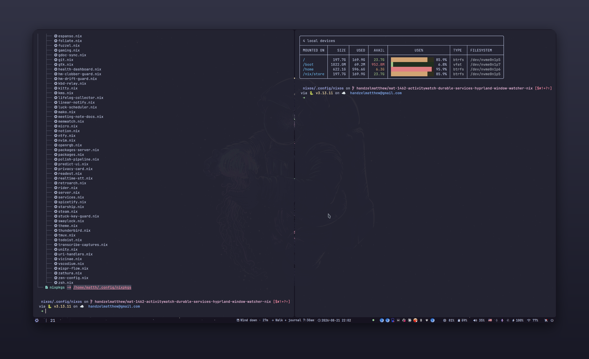

<!-- showcase:begin — generated by docs/showcase/showcase.sh, do not edit by hand -->

# Matt's NixOS

> One flake, four hosts, and a lot of services whose job is to make the machine disagree with me when I'm wrong.

**4** hosts · **115** modules · **118** systemd units · **109** scripts · **21** flake inputs

This is the whole of my computing environment as a single Nix flake — the laptop
I work on, the server that runs the always-on half, and the desktop and VM that
share their modules with both. Hyprland, Neovim, Zsh and Catppuccin are the
surface. Most of the actual code underneath is background services: focus
enforcement, capture and transcription pipelines, backups, and watchdogs whose
entire purpose is to notice when one of the others has quietly stopped working.

The modules carry unusually long comments on purpose. Nearly every one of them
exists because something broke on a specific day, and the comment records what
broke and why the fix is shaped the way it is. The tables further down are
generated from those comments, so the README says exactly what the code says.



<sub>Hyprland with Waybar, Catppuccin Mocha throughout — Neovim on a system module, btop, and the shell.</sub>

## What's actually in here

### Focus enforcement I can't talk myself out of

The distraction blocker doesn't run on the machine being blocked. A [blocky][]
resolver on the home server holds two deny-lists — a calendar-driven one that
fills up only during a Deep Work or Comms block, and a permanent one synced from
a plain Markdown file in my notes — and every device reaches it over Tailscale.
The off-switch is on the other side of the network from the impulse, which is
the entire design: *the kill-switch must cost more than the impulse.*

The obvious failure mode of that design is that a dead server takes the internet
with it. So each device runs its own local watchdog that pings blocky and flips
`tailscale set --accept-dns` off when it can't be reached, with a two-strike
debounce so one lost packet doesn't flap it. It runs locally precisely so that
it still works when the server is the thing that's down. There's also a
sanctioned, auto-expiring pause — if the only way past the block is to defeat
it, you learn to defeat it.

[blocky]: https://github.com/0xERR0R/blocky



<sub>Source: [`modules/core/focus-dns.nix`](modules/core/focus-dns.nix), [`modules/core/focus-failopen-watchdog.nix`](modules/core/focus-failopen-watchdog.nix), [`modules/core/focus-nameserver-watchdog.nix`](modules/core/focus-nameserver-watchdog.nix), [`modules/core/focus-mode-resolver.nix`](modules/core/focus-mode-resolver.nix), [`modules/core/focus-pause.nix`](modules/core/focus-pause.nix), [`modules/core/focus-state-agent.nix`](modules/core/focus-state-agent.nix)</sub>

### A config that notices when it has broken itself

Home Manager runs here as a NixOS module, which means the generation that
activates at boot is the one baked into the *system* generation. `hm-switch` and
`nixos-rebuild test` both apply immediately and are then silently reverted at the
next boot — and a reverted fix is indistinguishable from a fix that never worked.
That cost me a service that was "verified working" and arrived broken after every
reboot, so there is now a guard that detects the revert and says so.

A second guard handles the other half: Home Manager refuses to activate when a
path it manages is occupied by a foreign *symlink*, because `backupFileExtension`
only rescues regular files. It clears those before the check runs.

And when a unit or script does fail, the journal watcher hands the failure to a
headless Claude instance that diagnoses it, fixes it declaratively in this flake,
rebuilds, and reports back over ntfy. It follows the journal rather than relying
on `OnFailure=` alone, because plenty of things that fail here aren't systemd
units at all.

<sub>Source: [`modules/home/hm-drift-guard.nix`](modules/home/hm-drift-guard.nix), [`modules/home/hm-clobber-guard.nix`](modules/home/hm-clobber-guard.nix), [`modules/home/claude-autofix.nix`](modules/home/claude-autofix.nix)</sub>

### Losing data once was enough

On 2026-05-05 a `git filter-repo` run destroyed ~1.9 GB of irreplaceable personal
media. The files existed only locally, pushes had been failing, and Syncthing
versioning was off, so the deletion propagated cleanly to the server with nothing
preserved anywhere.

`/home` now takes hourly btrfs snapshots into its own subvolume with 24-hour
retention. Filesystem-level snapshots survive any mistake made at the git or
Syncthing layer, because they sit underneath both, and copy-on-write makes them
almost free until something actually churns. A separate timer watches free space
on `/` and `/home` and pushes an ntfy alert on threshold crossings — the same
disk filling up silently has killed Syncthing here before. Secrets live in a
gocryptfs vault rather than in the tree.

<sub>Source: [`modules/core/btrfs-snapshots.nix`](modules/core/btrfs-snapshots.nix), [`modules/core/disk-space-alert.nix`](modules/core/disk-space-alert.nix), [`modules/core/gocryptfs-vault.nix`](modules/core/gocryptfs-vault.nix), [`modules/core/sops.nix`](modules/core/sops.nix)</sub>

### Speech in and out, on my own hardware

Dictation is the primary input method for anything longer than a command. The
server runs the heavy models on its GPU — faster-whisper and NVIDIA Canary for
transcription, Kokoro-82M for speech — while the laptop keeps a lighter realtime
path for push-to-talk.

Two of the fiddlier problems here got their own modules. Hyprland can't tell the
left and right Alt keys apart, so kanata runs over the laptop keyboard for the
sole purpose of making "both Alts together" a detectable chord to trigger
dictation. And Wispr Flow enumerates evdev keyboards once at startup and never
watches udev, so a Bluetooth keyboard connected afterwards is invisible to it —
a relay re-presents the keyboard so it's seen without restarting the app.

<sub>Source: [`modules/core/canary-stt-server.nix`](modules/core/canary-stt-server.nix), [`modules/core/faster-whisper-server.nix`](modules/core/faster-whisper-server.nix), [`modules/core/kokoro-tts.nix`](modules/core/kokoro-tts.nix), [`modules/core/text-to-speech-service.nix`](modules/core/text-to-speech-service.nix), [`modules/home/realtime-stt.nix`](modules/home/realtime-stt.nix), [`modules/home/wispr-flow.nix`](modules/home/wispr-flow.nix), [`modules/home/kbd-relay.nix`](modules/home/kbd-relay.nix), [`modules/core/kanata-homerow.nix`](modules/core/kanata-homerow.nix)</sub>

### The notes are part of the operating system

My Obsidian vault isn't a separate app I open — it's plumbed into the machine.
A semantic search service indexes it, MCP servers expose it to agents, meeting
audio is transcribed on capture, upcoming meetings get a Google Doc created for
them automatically, and Markdown files reconcile two-way with Google Docs on a
timer. Screen and window activity are logged locally by the lifelog collector and
ActivityWatch, with a Hyprland-native window watcher so the titles are real.

Capture is deliberately low-friction: an ntfy topic doubles as an inbox, so
anything sent from my phone lands in the vault without opening a laptop.

<sub>Source: [`modules/core/second-brain-search.nix`](modules/core/second-brain-search.nix), [`modules/core/obsidian-mcp.nix`](modules/core/obsidian-mcp.nix), [`modules/core/mcp-server.nix`](modules/core/mcp-server.nix), [`modules/core/ntfy-capture-listener.nix`](modules/core/ntfy-capture-listener.nix), [`modules/home/lifelog-collector.nix`](modules/home/lifelog-collector.nix), [`modules/home/activitywatch.nix`](modules/home/activitywatch.nix), [`modules/home/meeting-note-docs.nix`](modules/home/meeting-note-docs.nix), [`modules/home/gdoc-sync.nix`](modules/home/gdoc-sync.nix), [`modules/home/transcribe-captures.nix`](modules/home/transcribe-captures.nix)</sub>

### Hardware that fought back, and the modules that won

A running list of things this laptop does wrong, each pinned down with
measurements rather than guesses.

Captive portals were the best one. Airplane and hotel Wi-Fi consistently refused
to work, and the cause turned out to be that `tailscaled` runs `resolvconf -x`
and erases the DHCP resolver the portal needs — while NetworkManager's own portal
detection ships disabled in nixpkgs, so the connectivity check cheerfully
reported "full" the whole time.

The rest: this machine has no working S3 sleep and a non-compliant ACPI lid
switch that fires millisecond-long pulses, so it used to wake the instant it was
closed. Bluetooth keyboards lose their evdev binding across resume, and BlueZ
burns the radio paging powered-off trusted devices every 44 seconds. Bluetooth
headphones need classic A2DP forced, because the LE-Audio half-negotiation leaves
them "connected" with no PipeWire sink at all.



<sub>Source: [`modules/core/captive-portal.nix`](modules/core/captive-portal.nix), [`modules/core/laptop-sleep.nix`](modules/core/laptop-sleep.nix), [`modules/core/bluetooth.nix`](modules/core/bluetooth.nix), [`modules/core/pipewire.nix`](modules/core/pipewire.nix), [`modules/home/stuck-key-guard.nix`](modules/home/stuck-key-guard.nix)</sub>

### Self-hosted, on the box in the other room

Finance tracking (Firefly III plus the Pico mobile UI), RSS, a wiki, web
analytics, and Prometheus + Grafana watching all of it, including a custom
exporter that turns the finance data into metrics. Notifications for everything
fan out through a single ntfy topic that reaches both the desktop and my phone,
which also makes it the one notification path that works from a systemd unit
with no session bus.

<sub>Source: [`modules/core/firefly-iii.nix`](modules/core/firefly-iii.nix), [`modules/core/firefly-pico.nix`](modules/core/firefly-pico.nix), [`modules/core/freshrss.nix`](modules/core/freshrss.nix), [`modules/core/silverbullet.nix`](modules/core/silverbullet.nix), [`modules/core/rybbit.nix`](modules/core/rybbit.nix), [`modules/core/monitoring.nix`](modules/core/monitoring.nix), [`modules/core/ntfy-scheduler.nix`](modules/core/ntfy-scheduler.nix)</sub>

### The desktop itself

Hyprland with Waybar, Catppuccin Mocha end to end, Vicinae as the command
palette, fuzzel for quick launching, and Neovim as the editor. Around a hundred
personal scripts sit on `PATH` through Home Manager — including `kbshot`, which
takes a screenshot of a labelled on-screen region entirely from the keyboard, no
mouse involved.

Every new user-facing tool gets an `xdg.desktopEntry` in the same module that
defines it, on the theory that a feature you can't find in the launcher isn't
finished.



<sub>Source: [`modules/home/vicinae.nix`](modules/home/vicinae.nix), [`modules/home/fuzzel.nix`](modules/home/fuzzel.nix), [`modules/home/nvim.nix`](modules/home/nvim.nix), [`modules/home/kitty.nix`](modules/home/kitty.nix), [`modules/home/theme.nix`](modules/home/theme.nix), [`modules/home/waybar/waybar.nix`](modules/home/waybar/waybar.nix)</sub>

## Hosts

| Host | Role |
| --- | --- |
| `desktop` | Shares the core module set; adds gaming and the heavier creative tooling. |
| `laptop` | Primary machine — Acer Swift SF16-51T. Everything interactive lives here. |
| `server` | Always-on host: DNS-level focus enforcement, self-hosted services, GPU speech models. |
| `vm` | Throwaway target for testing the flake without touching real hardware. |

```sh
sudo nixos-rebuild switch --flake .#laptop
```

## Every module

Summaries below are lifted straight from each module's own leading comment, so they cannot drift from the code.

<details>
<summary><b>System — `modules/core`</b> — 53 modules, 17 with a written rationale</summary>

| Module | What it does |
| --- | --- |
| [`bluetooth`](modules/core/bluetooth.nix) | Keeps BLE keyboards (TOTEM, Corne) actually usable across suspend/resume. |
| [`btrfs-snapshots`](modules/core/btrfs-snapshots.nix) | Hourly btrfs snapshots of /home, with simple retention. |
| [`calendar-agenda`](modules/core/calendar-agenda.nix) | Calendar agenda writer — feeds the waybar "now / next" slot. |
| [`captive-portal`](modules/core/captive-portal.nix) | Captive portals (airplane, hotel, café Wi-Fi) must always just work. |
| [`firefly-pico`](modules/core/firefly-pico.nix) | Firefly Pico -- mobile-optimised companion UI for Firefly III. https://github.com/cioraneanu/firefly-pico (AGPL-3.0, ~950 stars, actively developed) |
| [`focus-dns`](modules/core/focus-dns.nix) | System-Wide Focus — off-device DNS enforcement (blocky), fail-open. |
| [`focus-failopen-watchdog`](modules/core/focus-failopen-watchdog.nix) | System-Wide Focus — per-device FAIL-OPEN watchdog. |
| [`focus-mode-resolver`](modules/core/focus-mode-resolver.nix) | System-Wide Focus — calendar-driven mode resolver (Phase 2). |
| [`focus-nameserver-watchdog`](modules/core/focus-nameserver-watchdog.nix) | System-Wide Focus — Tailscale nameserver watchdog (anti-bypass). |
| [`focus-pause`](modules/core/focus-pause.nix) | System-Wide Focus — sanctioned, auto-expiring pause (`focus-pause`). |
| [`focus-state-agent`](modules/core/focus-state-agent.nix) | System-Wide Focus — laptop/desktop focus-state agent. |
| [`gmail-automation`](modules/core/gmail-automation.nix) | Python bundled with the Google client libraries the poller needs. No pip, no ~/.local — everything reproducible through Nix. |
| [`kanata-homerow`](modules/core/kanata-homerow.nix) | kanata for the laptop keyboard. |
| [`kokoro-tts`](modules/core/kokoro-tts.nix) | Kokoro-82M text-to-speech, on the server's GPU. |
| [`laptop-sleep`](modules/core/laptop-sleep.nix) | Sleep on the Acer Swift SF16-51T |
| [`monitoring`](modules/core/monitoring.nix) | Prometheus + Grafana + the Firefly III exporter. |
| [`waydroid`](modules/core/waydroid.nix) | Waydroid runs a full Android container on top of the Wayland session so we can run Android-only apps (e.g. Granola, which ships no Linux desktop build). |

*No module-level comment yet — these do their job without explaining themselves:* [`activitywatch-server`](modules/core/activitywatch-server.nix), [`atuin`](modules/core/atuin.nix), [`bootloader`](modules/core/bootloader.nix), [`canary-stt-server`](modules/core/canary-stt-server.nix), [`disk-space-alert`](modules/core/disk-space-alert.nix), [`faster-whisper-server`](modules/core/faster-whisper-server.nix), [`firefly-iii`](modules/core/firefly-iii.nix), [`freshrss`](modules/core/freshrss.nix), [`gocryptfs-vault`](modules/core/gocryptfs-vault.nix), [`hardware`](modules/core/hardware.nix), [`mcp-server`](modules/core/mcp-server.nix), [`network`](modules/core/network.nix), [`nginx`](modules/core/nginx.nix), [`ntfy-capture-listener`](modules/core/ntfy-capture-listener.nix), [`ntfy-scheduler`](modules/core/ntfy-scheduler.nix), [`obsidian-mcp`](modules/core/obsidian-mcp.nix), [`pipewire`](modules/core/pipewire.nix), [`program`](modules/core/program.nix), [`project-watcher`](modules/core/project-watcher.nix), [`rybbit`](modules/core/rybbit.nix), [`second-brain-search`](modules/core/second-brain-search.nix), [`security`](modules/core/security.nix), [`server`](modules/core/server.nix), [`services-server`](modules/core/services-server.nix), [`services`](modules/core/services.nix), [`silverbullet`](modules/core/silverbullet.nix), [`sops`](modules/core/sops.nix), [`system`](modules/core/system.nix), [`taskwarrior-daily-notify`](modules/core/taskwarrior-daily-notify.nix), [`text-to-speech-service`](modules/core/text-to-speech-service.nix), [`tor`](modules/core/tor.nix), [`user`](modules/core/user.nix), [`virtualization-server`](modules/core/virtualization-server.nix), [`virtualization`](modules/core/virtualization.nix), [`wayland`](modules/core/wayland.nix), [`xserver`](modules/core/xserver.nix)

</details>

<details>
<summary><b>Home — `modules/home`</b> — 62 modules, 17 with a written rationale</summary>

| Module | What it does |
| --- | --- |
| [`activitywatch`](modules/home/activitywatch.nix) | aw-server, aw-watcher-afk and the generic aw-watcher-window all ship in the `activitywatch` package (already on PATH via packages.nix). |
| [`app-memory-caps`](modules/home/app-memory-caps.nix) | Wraps a binary so it lands in the named systemd user slice. systemd-run --scope places the process in a transient scope inside the slice; the slice's MemoryHigh/Max/SwapMax then apply collectively to… |
| [`claude-autofix`](modules/home/claude-autofix.nix) | claude-autofix — when a script or service fails, hand the failure to a headless Claude Opus instance that diagnoses it, fixes it declaratively in this flake, rebuilds, and reports back. |
| [`claude-syncthing-ignores`](modules/home/claude-syncthing-ignores.nix) | Syncthing ignore list for the `claude` folder (~/.claude), shared between laptop, matts-computer and matts-server. |
| [`gdoc-sync`](modules/home/gdoc-sync.nix) | Periodic two-way reconcile of every linked markdown ↔ Google Doc pair. |
| [`health-dashboard`](modules/home/health-dashboard.nix) | Where the health-data-dashboard pipeline lives. |
| [`hm-clobber-guard`](modules/home/hm-clobber-guard.nix) | Home Manager refuses to activate when a path it wants to manage is occupied by a foreign SYMLINK: backupFileExtension only rescues regular files (check-link-targets.sh guards the backup branch with… |
| [`hm-drift-guard`](modules/home/hm-drift-guard.nix) | Home Manager runs here as a NixOS module, so `home-manager-matth.service` activates the generation baked into the *system* generation at every boot: |
| [`kbd-relay`](modules/home/kbd-relay.nix) | Makes Wispr Flow see the Bluetooth TOTEM, without ever restarting Wispr. |
| [`linear-notify`](modules/home/linear-notify.nix) | Linear ships no Linux app, so we poll its GraphQL API for unread notifications and surface them through swaync via notify-send. |
| [`meeting-note-docs`](modules/home/meeting-note-docs.nix) | Give every upcoming meeting note a shareable Google Doc (MAT-1185, MAT-1813). |
| [`privacy-card`](modules/home/privacy-card.nix) | Scaffolding for the agent-issuable-capped-virtual-card half of the "shopping harness" (the non-sensitive part: no account creation, no login, no bank data — just calling the Privacy.com card-issuing API with a key Matt generates himself). |
| [`readest`](modules/home/readest.nix) | Readest's packaged desktop entry is `Exec=readest` with NO field code, so anything that opens a file by association (xdg-open, yazi, the browser's "open with") launches Readest with no argument — the app appears, the book never does. |
| [`stuck-key-guard`](modules/home/stuck-key-guard.nix) | Fixes the "Shift/Super/Ctrl is stuck down" bug that arrived with Wispr Flow. |
| [`uri-handlers`](modules/home/uri-handlers.nix) | 1. Create a wrapper script. We need this because nvim must run in a terminal, and we need to strip the "nvim://" prefix from the URI. |
| [`vicinae`](modules/home/vicinae.nix) | Vicinae — a native, Wayland-first Raycast clone: hit a hotkey, get a command palette (launch apps, run commands/scripts, clipboard history, calculator, timers). |
| [`wispr-flow`](modules/home/wispr-flow.nix) | Unofficial Linux port (github.com/wispr-flow-linux/wispr-flow-linux) — Wispr ships no native Linux app. |

*No module-level comment yet — these do their job without explaining themselves:* [`bat`](modules/home/bat.nix), [`btop`](modules/home/btop.nix), [`cava`](modules/home/cava.nix), [`discord`](modules/home/discord.nix), [`electron-app-daily-restart`](modules/home/electron-app-daily-restart.nix), [`espanso`](modules/home/espanso.nix), [`foliate`](modules/home/foliate.nix), [`fuzzel`](modules/home/fuzzel.nix), [`gaming`](modules/home/gaming.nix), [`git`](modules/home/git.nix), [`gtk`](modules/home/gtk.nix), [`kitty`](modules/home/kitty.nix), [`kms`](modules/home/kms.nix), [`lifelog-collector`](modules/home/lifelog-collector.nix), [`luck-scheduler`](modules/home/luck-scheduler.nix), [`mako`](modules/home/mako.nix), [`memwatch`](modules/home/memwatch.nix), [`micro`](modules/home/micro.nix), [`notion`](modules/home/notion.nix), [`ntfy`](modules/home/ntfy.nix), [`nvim`](modules/home/nvim.nix), [`openrgb`](modules/home/openrgb.nix), [`packages-server`](modules/home/packages-server.nix), [`packages`](modules/home/packages.nix), [`polish-pipeline`](modules/home/polish-pipeline.nix), [`predict-ui`](modules/home/predict-ui.nix), [`realtime-stt`](modules/home/realtime-stt.nix), [`retroarch`](modules/home/retroarch.nix), [`rider`](modules/home/rider.nix), [`server`](modules/home/server.nix), [`services`](modules/home/services.nix), [`spicetify`](modules/home/spicetify.nix), [`starship`](modules/home/starship.nix), [`steam`](modules/home/steam.nix), [`swaylock`](modules/home/swaylock.nix), [`theme`](modules/home/theme.nix), [`thunderbird`](modules/home/thunderbird.nix), [`tmux`](modules/home/tmux.nix), [`todoist`](modules/home/todoist.nix), [`transcribe-captures`](modules/home/transcribe-captures.nix), [`unity`](modules/home/unity.nix), [`vscodium`](modules/home/vscodium.nix), [`zathura`](modules/home/zathura.nix), [`zen-config`](modules/home/zen-config.nix), [`zsh`](modules/home/zsh.nix)

</details>

## Flake inputs

<details>
<summary>21 pinned inputs</summary>

| Input | Source |
| --- | --- |
| `alejandra` | kamadorueda/alejandra @ 3.0.0 |
| `aw-watcher-window-hyprland` | bobvanderlinden/aw-watcher-window-hyprland |
| `betterbird` | Heehaaw/betterbird-flake |
| `catppuccin` | catppuccin/nix |
| `claude-desktop` | aaddrick/claude-desktop-debian |
| `gdoc-sync-src` | local path |
| `home-manager` | nix-community/home-manager @ master |
| `hypr-contrib` | hyprwm/contrib |
| `hyprpicker` | hyprwm/hyprpicker |
| `nix-gaming` | fufexan/nix-gaming |
| `nixpkgs` | NixOS/nixpkgs @ nixos-unstable-small |
| `nixpkgs-readest` | NixOS/nixpkgs |
| `nur` | nix-community/NUR |
| `project-asset-generator-src` | local path |
| `second-brain-search` | local path |
| `sops-nix` | Mic92/sops-nix |
| `spicetify-nix` | gerg-l/spicetify-nix |
| `text-to-speech-service` | local path |
| `vicinae` | vicinaehq/vicinae @ v0.23.2 |
| `whisper-overlay` | oddlama/whisper-overlay |
| `zen-browser` | 0xc000022070/zen-browser-flake |

</details>

## Repo layout

```
flake.nix              inputs + the four nixosConfigurations
hosts/<name>/          per-host manifests and hardware config
modules/core/          system-level NixOS modules
modules/home/          Home Manager modules (apps, desktop, user services)
modules/home/scripts/  the personal script suite
pkgs/                  packages not in nixpkgs
docs/showcase/         the tooling that generates this README
```

## Regenerating this README

```sh
docs/showcase/showcase.sh capture     # screenshots, on an offscreen virtual output
docs/showcase/showcase.sh readme      # re-read the modules, rewrite the tables
docs/showcase/showcase.sh readme --check   # CI: fail if it drifted
```

Screenshots are taken on a headless Hyprland output parked off-canvas, so
capturing never switches workspace, moves focus, or shows up on the real screen.
See [`docs/showcase/`](docs/showcase/) for the details.

<!-- showcase:end -->

# Matt's nixos config


<!-- Links -->
[Hyprland]: https://github.com/hyprwm/Hyprland
[Kitty]: https://github.com/kovidgoyal/kitty
[Starship]: https://github.com/starship/starship
[Waybar]: https://github.com/Alexays/Waybar
[fuzzel]: https://codeberg.org/dnkl/fuzzel>
[Btop]: https://github.com/aristocratos/btop
[nemo]: https://github.com/linuxmint/nemo
[yazi]: https://github.com/sxyazi/yazi
[zsh]: https://ohmyz.sh/
[oh-my-zsh]: https://ohmyz.sh/
[Swaylock-effects]: https://github.com/mortie/swaylock-effects
[audacious]: https://audacious-media-player.org/
[mpv]: https://github.com/mpv-player/mpv
[VSCodium]:https://vscodium.com/
[Neovim]: https://github.com/neovim/neovim
[grimblast]: https://github.com/hyprwm/contrib
[imv]: https://sr.ht/~exec64/imv/
[swaync]: https://github.com/ErikReider/SwayNotificationCenter
[Nerd fonts]: https://github.com/ryanoasis/nerd-fonts
[NetworkManager]: https://wiki.gnome.org/Projects/NetworkManager
[network-manager-applet]: https://gitlab.gnome.org/GNOME/network-manager-applet/
[wl-clip-persist]: https://github.com/Linus789/wl-clip-persist
[wf-recorder]: https://github.com/ammen99/wf-recorder
[hyprpicker]: https://github.com/hyprwm/hyprpicker
[Catppuccin]: https://github.com/catppuccin/catppuccin
[catppuccin-papirus-folders]: https://github.com/catppuccin/papirus-folders
[Nordzy-cursors]: https://github.com/alvatip/Nordzy-cursors
[maxfetch]: https://github.com/jobcmax/maxfetch
